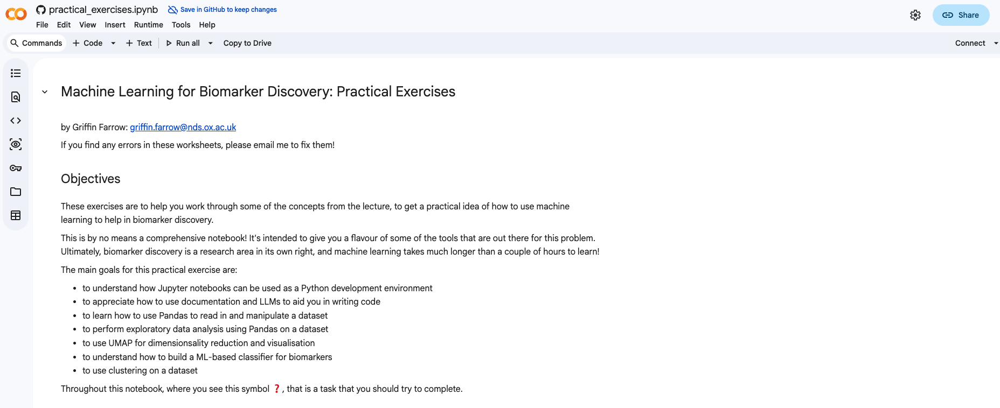
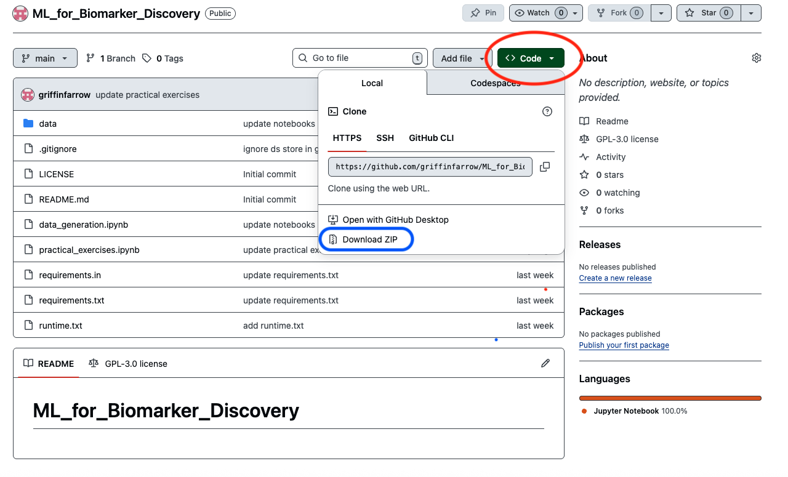

# Machine Learning for Biomarker Discovery

These are the course materials for the practical course **Machine Learning for Biomarker Discovery**, led by Griffin Farrow and Dan Woodcock.  
For any course-specific questions, please contact the course organisers directly.

Click here to open the course content in Colab: 

---

## Course overview

This practical course provides an applied introduction to **machine learning methods for biomarker discovery in precision medicine**, with a focus on working with high-dimensional biological and clinical data using Python.

The materials are designed to **complement the accompanying lecture slides**, and emphasise hands-on experience rather than theoretical depth. By working through the exercises, you will gain practical familiarity with common data analysis and machine learning workflows used in biomarker research.

The course is **self-guided** and can be completed at your own pace. All content is contained within a single interactive Jupyter notebook: `practical_exercises.ipynb`.

---

## Learning objectives

By the end of this practical, you should be able to:

- Use **Jupyter notebooks** to develop and run Python code interactively
- Manipulate and explore tabular biomedical datasets using **Pandas**
- Apply **exploratory data analysis (EDA)** to identify structure and heterogeneity in patient data
- Use **UMAP** for dimensionality reduction and visualisation of high-dimensional datasets
- Perform **supervised machine learning** using **random forest classification** with `scikit-learn`
- Interpret model outputs in the context of biomarker discovery

This course is **not intended to be a comprehensive introduction to machine learning**, but rather to provide a practical first exposure to techniques commonly used in modern biomarker research.

---

## Accessing the course materials

There are several ways to run the course notebook. Please ensure **before the course** that you are able to use *at least one* of the following options.

---

### 1) Google Colab (recommended)

**A Google account is required for this option.**

You can run the course notebook directly in Google Colab without installing anything locally. Your completed notebook will be saved automatically to your Google Drive (in the `Colab Notebooks` folder).

Click the button below to open the notebook:

When the notebook opens, you should see a page similar to the image below:

---

### 2) Running locally with Jupyter (more advanced)

If you are comfortable using Jupyter notebooks locally, you can run the course materials on your own machine.

1. Download the repository using the **Download ZIP** option from the GitHub **Code** menu:

   

2. Extract the ZIP file  
3. Open `practical_exercises.ipynb` using Jupyter Notebook or JupyterLab

You may need to ensure that the required Python packages are installed in your environment.

---

### 3) Binder (no installation required)

Binder allows you to run the course materials in a temporary cloud environment without installing Python or any dependencies locally.

To launch Binder, click here:

[Launch Binder](https://mybinder.org/v2/gh/griffinfarrow/ML_for_Biomarker_Discovery/main)

**Important limitations of Binder:**

- The environment can be slow to start (up to ~10 minutes)
- Your work is **not saved** between sessions
- Any progress will be lost when the session ends

Binder is best used as a fallback option if Colab is unavailable.

